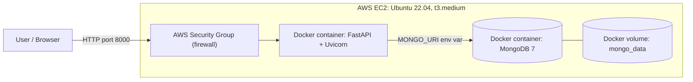

# Deployed AI Home Assistant (LEO)

Cloud deployment of the **LEO AI Elderly Care Assistant** backend on **AWS EC2**, containerized with **Docker Compose** and redeployed automatically by a **GitHub Actions CI/CD pipeline**.

This repository documents the deployment work: the Docker setup, the pipeline, the problems I hit, and how I fixed them. The application itself was built as a Final Year Project at GC University Lahore. Its source code lives here: [AI-Powered-Elderly-Care-Assistant-LEO-FYP-](https://github.com/AyeshaAbaid/AI-Powered-Elderly-Care-Assistant-LEO-FYP-)

---

## Overview

I wanted to take a university project and run it the way a real service runs: on a Linux server in the cloud, packaged in containers, and updated automatically on every `git push`.

**Result:** a live FastAPI + MongoDB backend on AWS, reachable from the internet, with zero manual steps after a push.

| Deployed | Not deployed |
|---|---|
| FastAPI REST API (Uvicorn) | Flutter mobile/web app |
| MongoDB 7 with persistent volume | CustomTkinter desktop GUI |
| Docker Compose (API + database) | Live camera fall detection (needs camera and GPU; YOLO weights are not in the repo) |
| GitHub Actions CI/CD over SSH | Chat LLM module (large model files not in the repo) |

---

## Architecture



## CI/CD Pipeline


---

## Tech Stack

| Area | Tools |
|---|---|
| Cloud | AWS EC2, Security Groups, EC2 Instance Connect |
| OS | Ubuntu 22.04 LTS |
| Containers | Docker, Docker Compose |
| Backend | Python 3.10, FastAPI, Uvicorn, PyMongo |
| Database | MongoDB 7 |
| CI/CD | GitHub Actions, SSH, GitHub Secrets |
| Tools | Git, VS Code |

---

## Files in This Repo

| File | Purpose |
|---|---|
| `Dockerfile` | Builds the API image (Python 3.10, CPU PyTorch, dependencies) |
| `docker-compose.yml` | Runs the API and MongoDB together, with a data volume and auto-restart |
| `requirements-server.txt` | Server-only Python dependencies |
| `deployment/deploy.yml` | The GitHub Actions workflow (reference copy) |
| `.env.example` | Shows which environment variables the app reads |
| `screenshots/` | Proof of the working deployment |

These files are built against the `FYP_Backend` folder of the original project.

---

## Deployment Steps

1. **Launch the server.** EC2 instance with Ubuntu 22.04, `t3.medium`, 30 GB storage. Security group allows SSH (port 22) and TCP 8000.
2. **Install Docker.**
   ```bash
   curl -fsSL https://get.docker.com | sudo sh
   sudo usermod -aG docker ubuntu
   ```
3. **Get the code.**
   ```bash
   git clone https://github.com/AyeshaAbaid/AI-Powered-Elderly-Care-Assistant-LEO-FYP-.git leo
   cd leo/FYP_Backend
   ```
4. **Make the database address configurable.** The app had `localhost` hardcoded. I changed it to read the `MONGO_URI` environment variable, so it can reach the MongoDB container.
5. **Build and run.**
   ```bash
   docker compose up -d --build
   ```
6. **Verify.** Open `http://<server-ip>:8000/docs` and call `GET /health`.
7. **Automate.** Create an SSH key pair, store the private key and server details as GitHub secrets (`SERVER_SSH_KEY`, `SERVER_HOST`, `SERVER_USER`), and add the workflow. Every push to `main` now redeploys the app.

---

## Problems I Hit and How I Fixed Them

| Problem | Cause | Fix |
|---|---|---|
| Instance launch failed: "SQL Server is not supported for t3.medium" | I had picked the Ubuntu image bundled with SQL Server | Chose plain Ubuntu Server 22.04 LTS |
| "Failed to connect to your instance" in the browser terminal | SSH rule allowed only my IP, but EC2 Instance Connect connects from AWS servers | Opened port 22 for this short-lived practice server (in production I would use SSM or a bastion host) |
| Repo had no `requirements.txt` | It was never committed | Read the `import` lines with `grep` and wrote `requirements-server.txt` myself |
| Docker build failed: could not find `flit_core` | `--index-url` pointed pip only at the PyTorch site | Changed to `--extra-index-url` so pip can also use the normal Python index |
| Browser terminal froze during the long build | Tab timeout | Ran the build in the background with `nohup` and watched `build.log` |
| `/health` reported missing `joblib`, then `transformers` | Heavy AI dependencies are not in the repo | Added `joblib` and `scikit-learn`, then stopped and documented the limitation |
| Live link stopped working after restarting the server | Public IP changes on every stop and start | Updated the `SERVER_HOST` secret (an Elastic IP is the permanent fix) |
| Pipeline failed: "missing server host" | Secret names did not match the workflow | Recreated the secrets with the exact names |
| Workflow never started | `.github` folder was inside `FYP_Backend` | Workflows must live in `.github/workflows` at the repo root |
| My code change did not appear on `/docs` | `main.py` contains two app blocks and the first one is commented out | Edited the active block |


## Known Limitations

- Only the backend is deployed. The Flutter app, desktop GUI, and live camera fall detection are not part of this deployment.
- `/health` reports `leo_ready: false`. The AI modules need `transformers`, `ultralytics`, a TTS library, and model weights, none of which are in the repository.
- The server runs over plain HTTP on port 8000. A production setup would add Nginx and HTTPS.
- SSH is open to the internet on this practice server. Production would use SSM or a bastion host.

---

## Cost and Cleanup

A `t3.medium` costs roughly $1 per day while running. After collecting these screenshots I terminated the instance, released any Elastic IP, deleted leftover volumes and snapshots, and checked Billing, so the live demo is no longer running.

## What I Learned

Linux server basics, Docker and Docker Compose, AWS EC2 and security groups, SSH key authentication, GitHub Actions and secrets, and above all: reading error logs patiently and fixing one problem at a time.

## Credits

The LEO application was built as a BS (Hons) Computer Science Final Year Project at GC University Lahore (2024-25) by **Muhammad Hunzla Khalid** (backend, computer vision), **Ayesha Abaidullah** (Flutter frontend, UI/UX), and **Shaiq Bhatti** (research, documentation, testing). Supervisor: Dr. Zia Ul Rehman.

My contribution in this repository is the deployment: Docker setup, AWS hosting, and the CI/CD pipeline.
